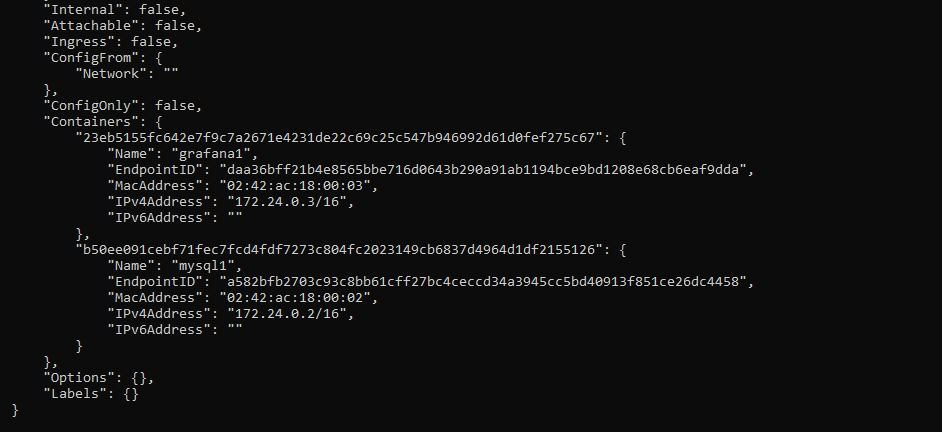
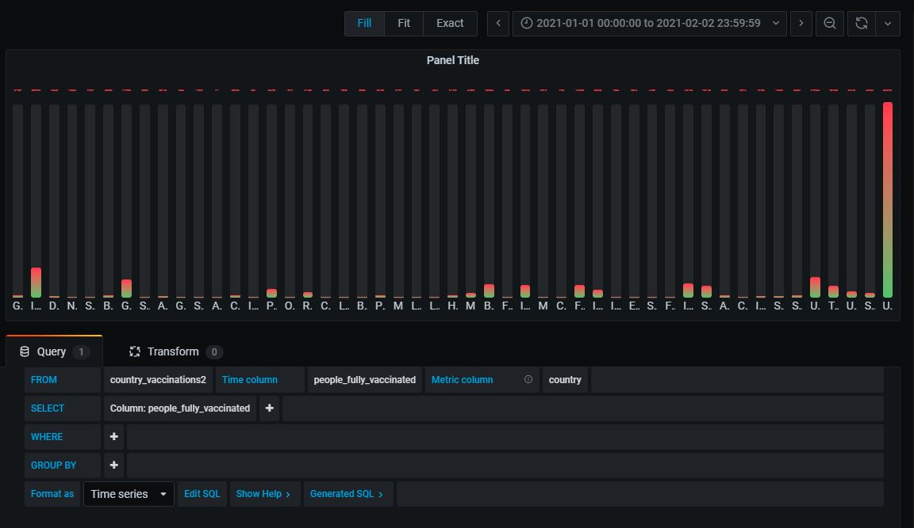
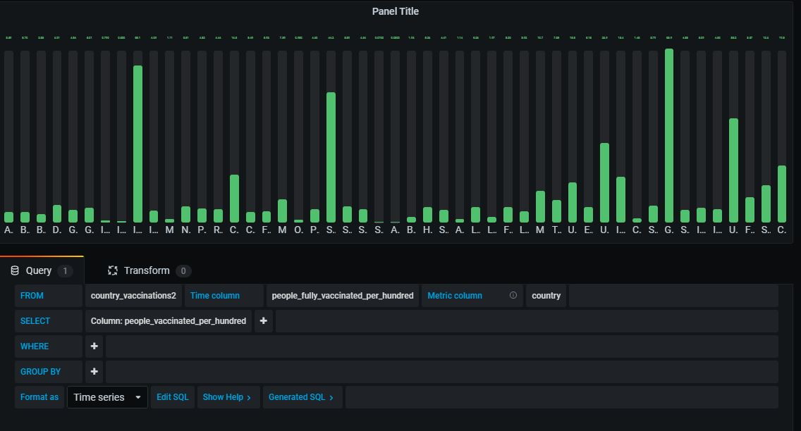
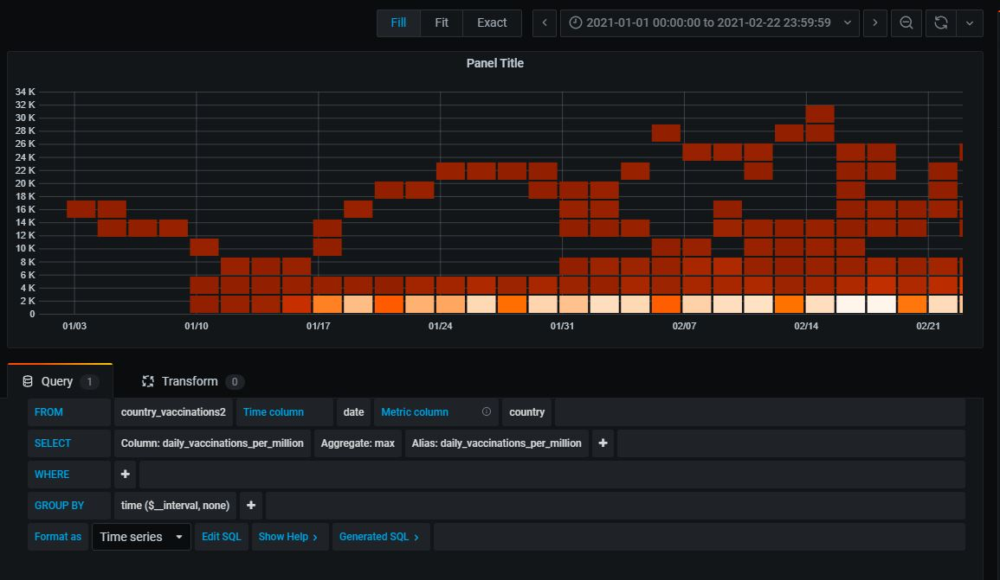
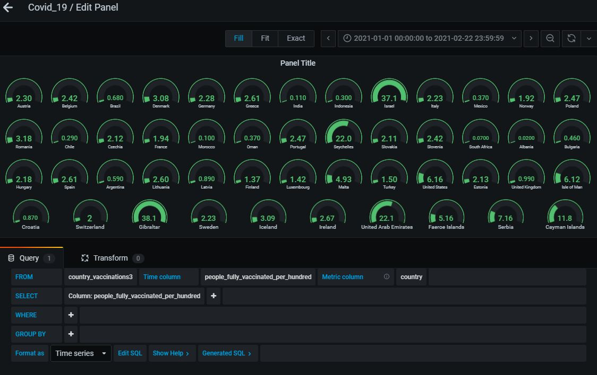
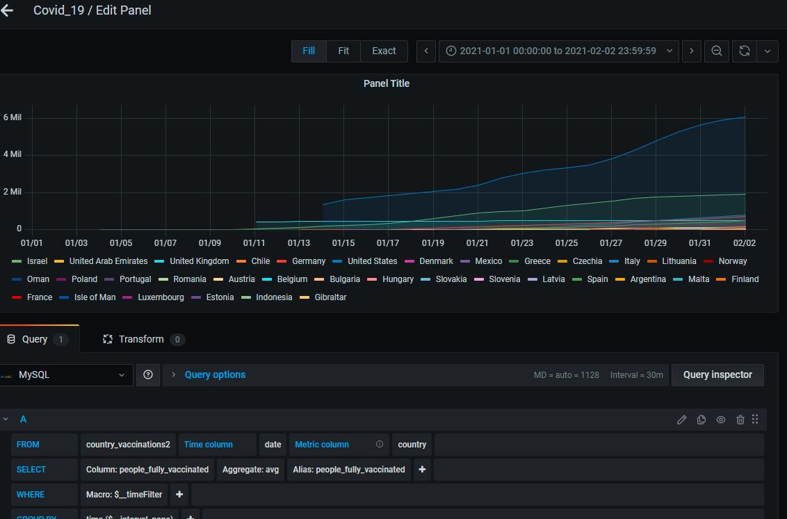
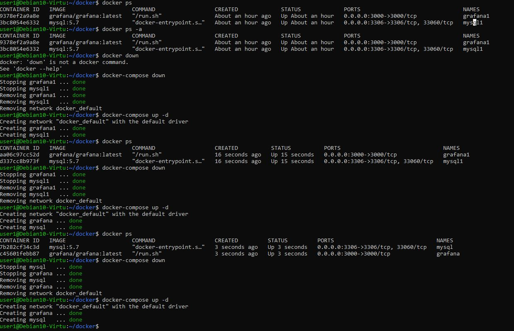

# Docker_Grafana_Covid


## Création du réseau(network)

Créez un réseau nommé mynetwork1 : docker network create mynetwork1


## Création des conteneurs

Créez le container mysql : docker run --net mynetwork1 --name mysql1 -p 3306:3306 -e
 MYSQL_ROOT_PASSWORD=password -d mysql:5.7 

Créez le container grafana : docker run --net mynetwork1 --name grafana1 -p 3000:3000 grafana/grafana:latest

## Inspection du réseau

Inspectez le réseau : docker network inspect mynetwork1

## Insertion des données par WorkBench


## Connection entre MySQL et Grafana

Notez l'adresse Ip des conteneurs ,notamment celui de mysql1 

Dans notre exemple, l’adresse Ip de mysql1 est 172.24.0.2 et le port est 3306. 
Lors de l’ajout de la base de données avec Grafana , il faudra noter 172.24.0.2:3306 dans la partie HOST . 


## Graphiques








### Quelques requêtes:
```
SELECT
  date AS "time",
  people_fully_vaccinated,
  people_vaccinated, daily_vaccinations
FROM country_vaccinations3
WHERE
  $__timeFilter(date) AND
  country = 'Germany'
ORDER BY date
```

```
SELECT
  date AS "time",
  country AS metric,
  daily_vaccinations
FROM country_vaccinations3
ORDER BY date
```

# Création de Docker-compose sur le serveur de l'Isen

## Connection au serveur de l'Isen

```
# ssh user@10.10.51.155

```
## docker-compose.yml 

```
version: "2"

services:
  grafana:
    container_name: grafana
    image: grafana/grafana:latest
    ports:
      - 3000:3000
    user: "root"


  mysql:
    container_name: mysql
    image: mysql:5.7
    ports:
    - "3306:3306"
    environment:
      MYSQL_ROOT_PASSWORD: password
      MYSQL_DATABASE: db1
    volumes:
    - ./db1_country_vaccinations3.sql:/docker-entrypoint-initdb.d/init.sql
  
```
## Création des conteneurs

``` docker-compose up -d```

## Connection entre grafana et mysql


## Quelques commandes utiles

### Voir tous les conteneurs actifs et non actifs:
docker ps -a

### Supprimer un docker-compose et ses conteneurs:

docker-compose down

### Travailler sur le conteneur mysql en bash:
docker exec -it data1_db_1 bash

### Se connecter à la base de données:
mysql -u user -ppassword

### Afficher les bases de données créés (bash) : 
show databases

### Créer un volume pour MySql

docker run --network mysql-net --name mon_mysql -e MYSQL_ROOT_PASSWORD=motdepasse -d mysql:latest --local-infile=1  -v c:/users/utilisateur/desktop/:/var/lib/mysql-files

### Lien utile pour l'installation de docker et docker-compose sur Ubuntu

https://www.bmc.com/blogs/mongodb-docker-container/
